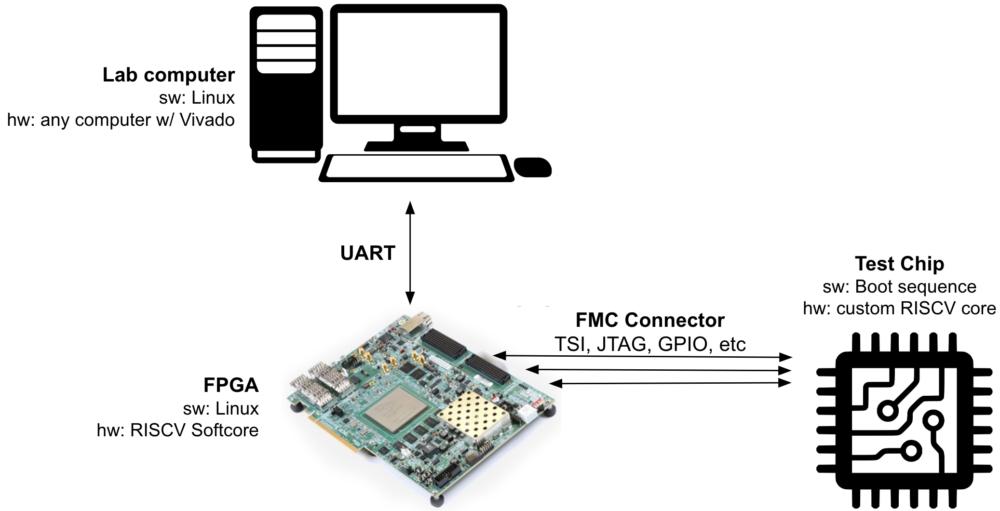
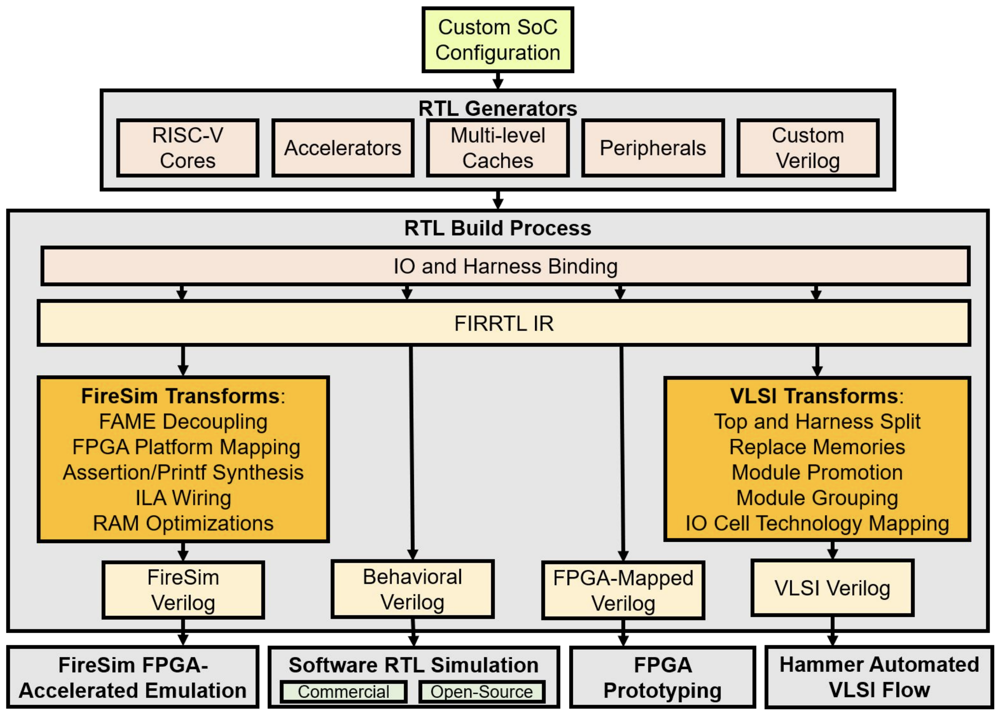
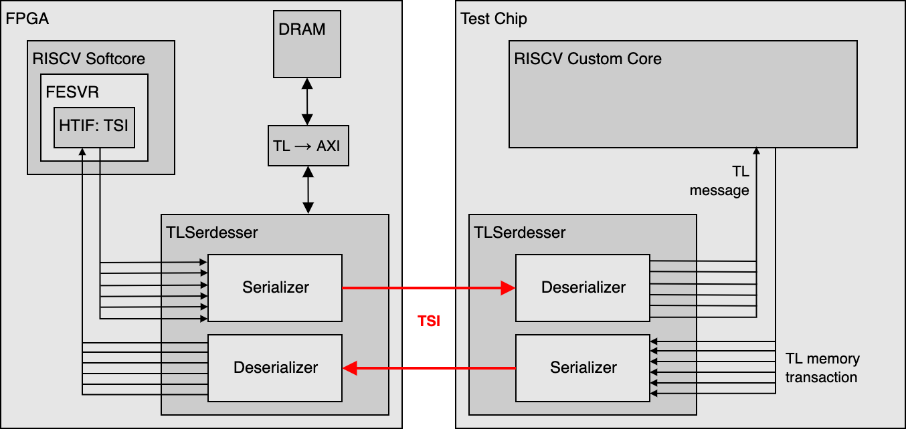

# Chipyard 

## Tutorial & Lab

BWRC & FPGA Bringup Platform Edition

## Overview

Our envisioned testing setup is shown below. Most of the testing will be driven by a large FPGA, the [Xilinx VCU118](https://www.xilinx.com/support/documents/boards_and_kits/vcu118/ug1224-vcu118-eval-bd.pdf), which will have a RISC-V Softcore running Linux and various C programs to send and receive signals from the test chip. The FPGA is connected to the chip via [FMC connector](https://upload.wikimedia.org/wikipedia/commons/thumb/c/ca/Samtec_ASP-134488-01_male_FMC_HPC_connector_PP008733.jpg/2560px-Samtec_ASP-134488-01_male_FMC_HPC_connector_PP008733.jpg) (basically just a high-bandwidth PCB pin connector that has high speed and analog/digital pins).



Both the core + digital peripherals on the test chip and FPGA were generated using the [Chipyard](https://github.com/ucb-bar/chipyard) framework. In this lab we will explore generating the verilog for these components, then converting the verilog to a bitstream to flash onto the FPGA.

Chipyard is an integrated design, simulation, and implementation framework for open source hardware development developed here at UC Berkeley. 
Chipyard is open-sourced online and is based on the Chisel and FIRRTL hardware description libraries, as well as the Rocket Chip SoC generation ecosystem.
Chipyard brings together much of the work on hardware design methodology from Berkeley over the last decade as well as useful tools into a single repository that guarantees version compatibility between the projects it submodules.





A designer can use Chipyard to build, test, and tapeout (manufacture) a RISC-V-based SoC.
This includes RTL development integrated with Rocket Chip, cloud FPGA-accelerated simulation with FireSim, and physical design with the Hammer framework.
Information about Chisel can be found in [https://www.chisel-lang.org/](https://www.chisel-lang.org/).
While you will not be required to write any Chisel code in this lab, basic familiarity with the language will be helpful in understanding many of the components in the system and how they are put together.

<!-- An initial introduction to Chisel can be found in the Chisel bootcamp:  [https://github.com/freechipsproject/chisel-bootcamp](https://github.com/freechipsproject/chisel-bootcamp).  -->
<!-- Detailed documentation of Chisel functions can be found in [https://www.chisel-lang.org/api/SNAPSHOT/index.html](https://www.chisel-lang.org/api/SNAPSHOT/index.html). -->

Throughout the rest of the course, we will be testing our chips using Chipyard as our base framework. 
There is a lot in Chipyard so we will only be able to explore a part of it in this lab, but hopefully you will get a brief sense of its capabilities.
We will generate a Rocket Chip-based design at the RTL level, and then synthesize and place-and-route it on the Xilinx VCU118 FPGA.


## Access & Setup

It should be clear by now this isn't going like most other courses. Most don't require signing non-disclosure agreements, or setting up a long string of IT infrastructure. Such is chip-design life. Make sure you have access to the BWRC servers and follow separate instructions to SSH into them before attempting the rest of this lab.


## Getting Started

First, we will need to setup our Chipyard workspace.  
All of our work will occur on the BWRC compute cluster. 
For this lab, please work in the `/tools/C/` directory on the machine. 
This lab will likely generate too much data for it to fit in your home directory. 


First source the following environment file. This will add pre-compiled binaries of all the RISC-V tools and Vivado to your PATH.
You will need to run these commands in every new terminal you open, so you should add them to your `~/.bashrc`.

```
source /tools/C/ee290/env-riscv-tools.sh
source /tools/xilinx/Vivado/2018.3/settings64.sh
source /tools/flexlm/flexlm.sh
```


Run the commands below. These commands clone the Chipyard repository, then initialize all the submodules. You only need to do this once.

```
mkdir -p /tools/C/<userName>/bringup
cd /tools/C/<userName>/bringup
git clone https://github.com/ucberkeley-ee290c/fa22-chipyard-bringup.git chipyard

cd chipyard
./scripts/init-submodules-no-riscv-tools.sh
./scripts/init-fpga.sh
```

You may have noticed while initializing your Chipyard repo that there are many submodules.  
Chipyard is built to allow the designer to generate complex configurations from different projects 
including the in-order Rocket Chip core, the out-of-order BOOM core, the systolic array Gemmini, and many other components needed to build a chip.
Thankfully, Chipyard has some great documentation, which can be found 
[here](https://chipyard.readthedocs.io/en/latest/).
You can find most of these in the `chipyard/generators/` directory.
All of these modules are built as generators (a core driving point of using Chisel), which means that each piece is parameterized and can be fit together with some of the functionality in Rocket Chip (check out the TileLink and Diplomacy references in the Chipyard documentation).
You can find the Chipyard specific code and its configs in `chipyard/generators/chipyard/src/main/scala/config`.
You can look at examples of how your own Chisel modules or verilog black-box modules can be integrated into a Rocket Chip-based SoC in `chipyard/generators/chipyard/src/main/scala/example`.
Many times, an accelerator block is connected to the Rocket core with a memory-mapped interface over the system bus. 
This allows the core to configure and read from the block.
Again, there is far too much to discuss fully here, but you can really put together a system very quickly using the infrastructure of Chipyard.

## FPGA Config Exploration
The Chipyard FPGA flow has been nicely configured to run with the Arty A7 and the VCU118 FPGA boards. We will be using the VCU118 setup.
Let's explore the configuration files:

```
cd ~chipyard/fpga/src/main/scala/vcu118
```

Open `Configs.scala` and briefly skim through the code, in particular look at `WithVCU118Tweaks`. How is the FPGA frequency being set? Can you trace classes being called in that class? (Hint: look at `~chipyard/generators/chipyard/src/main/scala/config/fragments/ClockingFragments.scala` for their implementations.

Next, open `FMCUtil.scala`. Here, you will see two objects: `FMCMap` and `FMCPMap`. These are utility functions that take the FMC connector pin name and return the VCU118 pin name. We have access to the FMC pin names [here](https://fmchub.github.io/appendix/VITA57_FMC_HPC_LPC_SIGNALS_AND_PINOUT.html), making it much easier to use these than the VCU118 pin names.

A previous student doing chip bringup graciously exposed more useful APIs with the VCU188, which we will explore next.
```
cd ~chipyard/fpga/src/main/scala/vcu118/bringup
```
Open `Configs.scala`. Compare the `RocketBringupConfig` in `vcu118/bringup/Configs.scala` file to the `RocketBringupConfig` in `vcu118/Configs.scala`
What are some of the changes added in `WithBringupAdditions`?


## Design Elaboration

The first step of the FPGA flow is to elaborate the Chisel source into verilog. 


**Note: For all compute intensive commands in the FPGA flow (all make commands from this point forwards), run them on the LSF.** In other words, prepend the command with

```
bsub -Is
```

To generate all of the verilog files, run:

```
make verilog SUB_PROJECT=bringup
```

- `SUB_PROJECT` is used to set various Makefile build variables like `CONFIG`, `BOARD`, and `FPGA_BRAND`. Open the Makefile to see what the values of these variables are for `SUB_PROJECT=bringup`.
- The`verilog` target describes a Makefile fragment that elaborates the Chisel source into verilog. After this command runs, the generated verilog for the design should appear in the `fpga/generated-src/<long-design-name>/<long-design-name>.top.v` directory.

Notice that in the Makefile, having `SUB_PROJECT=vcu118` selects the `chipyard.fpga.vcu118.RocketVCU118Config`, whereas `SUB_PROJECT=bringup` selects `chipyard.fpga.vcu118.bringup.RocketBringupConfig`.

### Configuring the TSI Host

One of the main ways we'll be debugging the digital portion of our chips is using the TSI (Tethered Serial Interface) protocol.
This interface consists of the following signals, where `N` is the width of the data as specified in the chipyard config (more on this below):
```
input tl_in_valid, tl_out_ready;
input [N:0] tl_in_bits;
output tl_in_ready, tl_out_valid;
output [N:0] tl_out_bits;
```

There is a serializer/deserializer module (TLSerdesser) on both the FPGA and the test chip, which converts the TileLink messages to the TSI protocol (serialize) and vice versa (deserialize). This interface is shown below.



This TSI interface must match EXACTLY for the FPGA to be able to communicate with the test chip, and it's a bit tricky to get the FPGA interface to match the test chip. Let's look at how this is done.

Go back to the `src/main/scala/vcu118/bringup/Configs.scala` file.
Arguably the most important part of the FPGA configuration is the `WithBringupPeripherals` addition. Look at the `case PeripheryTSIHostKey =>` list. The `TSIHostParams` class sets all of the parameters of the TSI host. As an example, `offchipSerialIfWidth` sets the data width `N` of `tl_in_bits` and `tl_out_bits` that was described earlier. For a full description of these configuration keys, see the [Chipyard documentation for TileLink Node Types](https://chipyard.readthedocs.io/en/latest/TileLink-Diplomacy-Reference/NodeTypes.html).

For the OsciBear chip, we are trying to match the following module declaration (this Verilog snippet is taken directly from the OsciBear post-synthesis netlist):

```
module GenericSerializer(clock, reset, io_in_ready, io_in_valid,
     io_in_bits_chanId, io_in_bits_opcode, io_in_bits_param,
     io_in_bits_size, io_in_bits_source, io_in_bits_address,
     io_in_bits_data, io_in_bits_corrupt, io_in_bits_union,
     io_in_bits_last, io_out_ready, io_out_valid, io_out_bits);
  input clock, reset, io_in_valid, io_in_bits_corrupt, io_in_bits_last,
       io_out_ready;
  input [2:0] io_in_bits_chanId, io_in_bits_opcode, io_in_bits_param;
  input [3:0] io_in_bits_size, io_in_bits_source;
  input [31:0] io_in_bits_address;
  input [63:0] io_in_bits_data;
  input [7:0] io_in_bits_union;
  output io_in_ready, io_out_valid, io_out_bits;
```

We have tried to replicate this in the `src/main/scala/vcu118/osci/Configs.scala` file. Look at the difference in `TSIHostParams` here versus in the `src/main/scala/vcu118/bringup/Configs.scala` file. Let's generate the verilog for the Osci configuration:

```
make verilog SUB_PROJECT=osci
```

Now open the generated verilog in `generated-src/*/*.top.v` file for the `RocketOsciConfig` (
`generated-src/chipyard.fpga.vcu118.osci.OsciVCU118FPGATestHarness.RocketOsciConfig/chipyard.fpga.vcu118.osci.OsciVCU118FPGATestHarness.RocketOsciConfig.top.v`)
and locate the module declaration for `GenericDeserializer`. Does this modules match our `GenericSerializer` above exactly?


## FPGA Bitstream Generation

Now it's time to generate the FPGA bitstream.
```
make bitstream SUB_PROJECT=osci
```
You may see the following "error" output, just ignore it, the `[success]` indicates a successful run:
```
[error] Picked up JAVA_TOOL_OPTIONS: -Xmx8G -Xss8M -Djava.io.tmpdir=/tools/C/nayiri/bringup/chipyard/.java_tmp
[error] WARNING: Empty *.mems.conf file. No memories generated.
[success] Total time: 3 s, completed Sep 8, 2022 4:28:09 PM
```

The final bitstream will be located in `generated-src/*/obj/*.bit` (`generated-src/chipyard.fpga.vcu118.osci.OsciVCU118FPGATestHarness.RocketOsciConfig/obj/*.bit`)


## Making a VCU118 Config for the BearlyML Chip

The previous students working on bringup had already modified the original `vcu118/bringup` config to get `vcu118/osci`. Your job is to create a similar configuration for the BearlyML chip taped out in Spring '21. You'll need to modify the `Makefile`, as well as copy the `osci` directory and rename things accordingly until the Chisel elaborates (hint: use the `sed` command to swap all the Osci naming for BearlyML in the files). Once the Chisel elaborates without errors, modify the `TSIHostParams` in `src/main/scala/vcu118/bearlyml/Configs.scala` to match the Verilog module declaration of the TSI serializer below.

```
module GenericSerializer(
  input         clock,
  input         reset,
  output        io_in_ready,
  input         io_in_valid,
  input  [2:0]  io_in_bits_chanId, io_in_bits_opcode, io_in_bits_param,
  input  [3:0]  io_in_bits_size, io_in_bits_source,
  input  [34:0] io_in_bits_address,
  input  [63:0] io_in_bits_data,
  input         io_in_bits_corrupt,
  input  [7:0]  io_in_bits_union,
  input         io_in_bits_last,
  input         io_out_ready,
  output        io_out_valid,
  output        io_out_bits
);
```

Which variable(s) did you have to change to make the `GenericDeserializer` in the generated Verilog match the above declaration?
Now generate a bitstream for your new BearlyML configuration!


## Linux Image Generation

COMING SOON!


## Conclusion

Chipyard is designed to allow you to rapidly build and integrate your design with general purpose control and compute as well as a whole host of other generators.
You can then take your design, run some RTL simulations, and then push it through the VLSI flow with the technology of your choice using Hammer.
The tools integrated with Chipyard, from how you actually build your design (eg. Chisel and generators), to how you verify and benchmark its performance, to how you physically implement it, are meant to enable higher design QoR within an agile hardware design process through increased designer productivity and faster design iteration.
We just scratched the surface in this lab, but there are always more interesting features being integrated into Chipyard.
We recommend that you continue to explore what you can build with Chipyard given this introduction!

## Acknowledgements

Thank you to the whole Chipyard dev team for figures and documentation on Chipyard, to Daniel Grubb for authorship of the original tutorial on which this lab is based, and to Jerry Zhao and Dan Fritchman for updating the lab.

