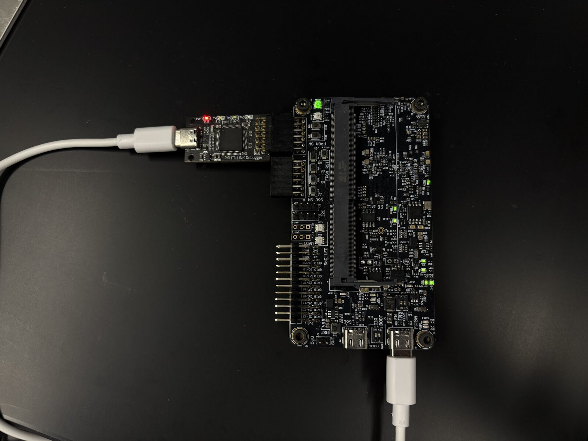
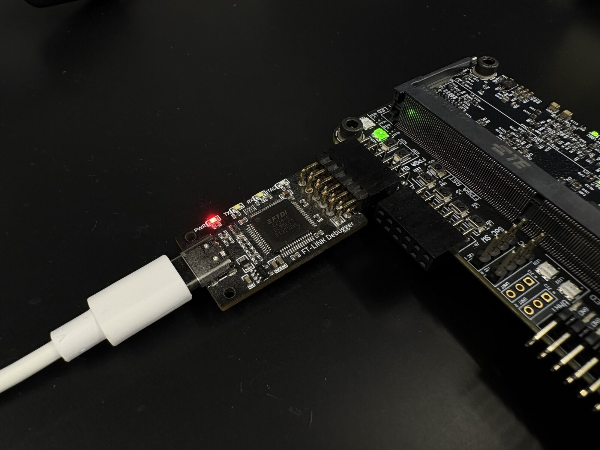

# Baremetal IDE Lab

Baremetal IDE is an SDK developed and maintained by the SLICE lab at Berkeley which allows you to quickly develop C/C++ for chips developed in Chipyard. As implied by the name, Baremetal IDE focuses on providing a bunch of libraries, scripts and device drivers to build “baremetal” programs which run without an operating system like Linux or Zephyr. Programming for bare metal means that you don’t have a bunch of operating system services that you may be used to like multithreading, device drivers, dynamic linking, etc, but in return, you have full control of your code and can extract the maximum amount of performance out of your chips. Baremetal IDE provides a thin layer of drivers and libraries that handles things like malloc or print. This lets you focus on building your workloads to test your chips instead of spending your time messing with linker scripts, stdlib versions, and device drivers.  
Since real chip setups are a bit fragile and require lots of external support equipment, we’ll be running all of these labs on a chip emulated on the SophiaLake FPGA board you used in Lab 3. This lab will bring you through the whole process of getting started with a new chip: building a Board Support Package, writing some basic drivers, and loading and debugging programs over UART-TSI and JTAG.

## The SophiaLake Board



Before we begin, let’s take a closer look at the SophiaLake board. Since this is the FPGA board we will be using for the rest of the class for bringup once the PCBs come back, it’s worth getting familiar with it. The board is built around an AMD Artix-7 100T FPGA (XC7A100T) with 1 GB of DDR memory. It also has a chip side for bringup: everything labeled "SoC" on the silkscreen belongs to a real chip, and we won't use any of it in this lab. Since this isn’t an FPGA lab, we’ll mostly be glossing over the inner workings of the board and just touch the parts you’ll have to work with directly:
1.	The USB-C port labeled "FPGA" on the bottom edge. The FPGA is programmed through it, and it also carries a USB-UART that this lab uses for UART-TSI
2.	Two PMOD headers on the left edge, J7 (upper) and J8 (lower), which provide 8 FPGA I/O pins each
3.	Two bi-color LEDs, LED20 and LED21, in the top left corner
4.	Two push buttons labeled "FPGA SW", SW8 and SW9
5.	The FPGA reset button, labeled "FPGA RST"

## The Lab Bitstream

For this lab, the SophiaLake boards set up on the lab benches are preprogrammed with `RocketSophiaLakeConfig` from the chipyard-lab repository, which emulates a Chipyard chip very similar to the ones that were taped out last semester and that you will be bringing up. It contains 1 Rocket core running at 50 MHz, 1 4-pin GPIO bank, 1GB of external DRAM, a 64 KiB scratchpad, 1 UART, 1 UART-TSI port, and a JTAG tap. The JTAG and UART ports go to a device called the FT-LINK, which acts like a combination USB UART adapter and USB JTAG adapter. It plugs into PMOD header J7 with its FTDI chip and LEDs facing up and its USB-C port pointing away from the board, like this:



{: .important }
The FT-LINK also fits into J7 upside down, but then JTAG and the UART won't work. If you plug it in yourself, match the photo.

{: .note }
If a board has lost its bitstream, you can rebuild it on the chipyard-lab `fa26-lab` branch (see below) from the `fpga/` directory with `make bitstream SUB_PROJECT=sophialake CONFIG=RocketSophiaLakeConfig` and program `generated-src/chipyard.fpga.sophialake.SophiaLakeHarness.RocketSophiaLakeConfig/obj/SophiaLakeHarness.bit` with Vivado, just like in Lab 3.

Here’s how things are connected on the FPGA:

| Board Part                 | Chip Function                         |
| -------------------------- | ------------------------------------- |
| "FPGA" USB-C port          | UART-TSI (921600 baud)                |
| "FPGA RST" button          | Chip Reset                            |
| LED20                      | FPGA status (blinks as a heartbeat)   |
| LED21, green               | GPIO 0                                |
| LED21, red                 | GPIO 1                                |
| SW8                        | GPIO 2                                |
| SW9                        | GPIO 3                                |
| PMOD J7 (FT-LINK)          | JTAG + UART                           |

The FPGA takes care of the board's LED wiring, so writing a 1 to an LED's pin lights it up, and a pressed button reads as 1.

And here’s a memory map of the system:

| Device                | Base Address |
| --------------------- | ------------ |
| Debug Module          | 0x0          |
| Boot Address Register | 0x1000       |
| Boot ROM              | 0x10000      |
| CLINT                 | 0x2000000    |
| Scratchpad (64 KiB)   | 0x8000000    |
| PLIC                  | 0xC000000    |
| GPIO A                | 0x10010000   |
| UART 0                | 0x10020000   |
| DRAM (1 GiB)          | 0x80000000   |

## Setup and Navigating the BWRC Environment

Before we begin writing software for Baremetal IDE we need to set up our workspace and compiler toolchain. While you can set this up locally on your machine [(see here)](https://ucb-bar.gitbook.io/chipyard/quickstart/setting-up-risc-v-toolchain) so you can build RISCV programs on your own machine, the documentation for how to do that is a bit out of date so the rest of this lab assumes you are using the BWRC environment. 
To begin, log into a BWRC machine by either SSHing into one of the login servers like `bwrcrdsl-1.eecs.berkeley.edu` or by going up to one of the four workstations that are set up on benches 11 and 12 in BWRC and logging in. Then set up the same environment you used in Lab 1 and Lab 3 by running the session commands from Lab 1:

``` bash
export chipyard=/tools/C/$USER/ee194-lab1
cd $chipyard
source ~/miniforge3/bin/activate
source ./env.sh
source /tools/C/ee194-sp26/bwrc-env.sh
```

Chipyard's `env.sh` puts the RISC-V toolchain, including GCC and GDB, on your path, and `bwrc-env.sh` sets up the rest of the course tools. You’ll need to run these commands every time you open a new terminal window so it may be worth placing them in your bashrc so you don’t have to keep typing them in. You only need Vivado if you have to reprogram the board. Set it up the same way as in Lab 3 with `source /tools/commercial/xilinx/Vivado/2024.2/settings64.sh`.

<!-- TODO(staff): confirm how students get OpenOCD on the bench workstations; it isn't part of the Chipyard conda environment. -->

> **On EDA machines:** as in Lab 1, your Chipyard is in `/scratch/$USER/ee194-lab1` and there is no `bwrc-env.sh`, so skip that line. You can build everything there, but the boards are at BWRC, so you'll need one of the lab bench workstations to program them.

The entire drive mapped to /tools/C is backed up hourly and available to all machines connected to the BWRC network, including the lab benches and login servers. This means you can remotely build on one of the BWRC servers from your laptop and have the files immediately show up on the lab machines to deploy to your chip.

Baremetal IDE ships with Chipyard as the `software/baremetal-ide` submodule of the chipyard-lab repository you cloned in Lab 1. This lab's code lives on the `fa26-lab` branch of chipyard-lab, which adds the GPIO, UART and JTAG ports to the SophiaLake config and points `software/baremetal-ide` at the lab's version of Baremetal IDE. Check out the branch, fetch Baremetal IDE, and move into it. If git complains about local changes from earlier labs, commit them first.

``` bash
cd $chipyard
git fetch origin
git checkout fa26-lab
git submodule update --init software/baremetal-ide
cd software/baremetal-ide
```

This lab also uses PyUARTSI, a Python program that loads programs onto the chip over UART-TSI. Install it into your Chipyard environment:

``` bash
python -m pip install pyuartsi
```

## Exploring Baremetal IDE
Now that we've got a copy of Baremetal IDE, let's take a closer look at all of its files and how it works. If you haven’t already, we highly recommend opening your Baremetal IDE folder in a proper editor, such as VSCode connected over SSH as in Lab 1. Baremetal IDE is based around [CMake]( https://cmake.org/), a meta build system that encourages modularity and makes it easy to manage lots of dependencies. CMake is incredibly powerful, but that power also comes with a good deal of complexity. While this lab will attempt to explain the basics, we highly encourage you to explore CMake further as it is one of the most widely used build systems for C/C++ in both embedded and application programming. While you are here, you should take some time to get familiar with the directory structure of Baremetal IDE. Here’s a quick overview to highlight the key files:

### `platform/sophialake`
Within the platform folder, we have a bunch of folders containing chip specific files and information. For today, this will be the `sophialake` folder. Each folder will have at minimum the five following files, though a chip may have more to support other functionality or include chip specific drivers.

`chip_config.h`  
This file contains defines for all of the MMIO devices within a chip as well as runtime information such as the system clock frequency. You should fill this file out with defines for all the devices that are on the chip and include those devices’ driver’s headers at the top.

`chip.c`  
A dummy file for CMake to add to include chip_config.h

`CMakeLists.txt`  
This is the file that tells CMake to add the header file we just created to the project, picks the device that `printf` and friends talk to, and defines what device drivers CMake should link. By default, this currently contains the Rocket core, CLINT, PLIC and UART drivers but you may need to add others for the rest of the lab using the `target_link_libraries` directive.

`sophialake.cfg`  
This file sets the OpenOCD configuration for JTAG debugging through the FT-LINK

`sophialake.ld`  
This is the linker script that allows us to specify where each segment of a program should go. The emulated chip has no flash, and its 64 KiB scratchpad is too small for most programs, so everything just goes into DRAM.

### `lab`
This folder contains a bunch of subfolders that each contain an `include` and `src` folder that you can write programs in. Each folder is setup to be its own target so you can build them individually without overwriting a previous step.

## Building Blinky

#### The Blinky Program
To introduce the Baremetal IDE build flow, we are going to start off with a blinky program which is kind of like the “Hello World” of embedded systems programming. All it will do is blink the LED attached to GPIO pin 0 at 5 Hz. This program has been simplified down to the bare minimum to make it easier to understand, ignoring all of the provided libraries and style conventions in favor of directly reading and writing to registers. We will go over cleaner, more idiomatic examples later on, but it’s important to know what’s going on underneath the hood. If you want to dig deeper into how the actual build process is handled and how all the steps of compilation fit together, Yufeng Chi from the SLICE lab has written an excellent guide [here]( https://notes.tk233.xyz/risc-v-soc/risc-v-baremetal-from-the-ground-up-chipyard-edition) going over how to build a program from scratch without something like Baremetal IDE.
``` c
#include <stdint.h>

volatile uint32_t *GPIOA_OUTPUT_VAL = (uint32_t*) 0x1001000CUL;
volatile uint32_t *GPIOA_OUTPUT_EN  = (uint32_t*) 0x10010008UL;
volatile uint64_t *CLINT_MTIME      = (uint64_t*) 0x0200BFF8UL;

void delay(uint64_t ticks) {
  uint64_t mtime_start = *CLINT_MTIME;
  while (*CLINT_MTIME - mtime_start < ticks);
}

void main() {
    int counter = 0;

    *GPIOA_OUTPUT_EN = 0b1;

    while (1) {
        if (counter % 2 == 0) {
            *GPIOA_OUTPUT_VAL = 0b1;
        } else {
            *GPIOA_OUTPUT_VAL = 0b0;
        }
        counter ++;
        delay(5000);
    }
}
```
The blinky program begins with some pointer definitions that define where all of the control registers of the GPIOs exist. Of special note is the `CLINT_MTIME` register which is separate from the GPIO bank. `CLINT_MTIME` is a register that simply counts up once every "tick", and on our chip a tick is 1/1000 of the clock frequency. For our 50 MHz chip, that's 50 kHz, which is useful for timing operations and setting delays. Next, we have a small function that uses the `MTIME` register to implement a small delay function, followed by our main program. Here, we simply enable pin zero’s output by writing a 1 to bit 0 of the `GPIOA_OUTPUT_EN` register, then jump into our blink loop, either setting pin 0 high or low depending on the counter and delaying for 5000 ticks. At 50 kHz, that's 100 ms, or 5,000,000 clock cycles, so the LED toggles 10 times a second, resulting in a blink rate of 5 Hz.

**Note:** Here we are using the `MTIME` counter to mark time. In other classes you may have seen a sleep() function that puts the CPU to sleep for a certain amount of time for LED blinking. We have a function that does this as well: `msleep(int milliseconds)`. BE CAREFUL, `msleep` keeps the core busy until the time is up, so no other work gets done in the meantime.

#### Building Blinky
If you take a look at the d01 folder within lab, you should also see a `CMakeLists.txt` file in addition to `main.c`. 
``` bash
#################################
# Build
#################################

add_executable(blinky
  main.c
)

target_compile_options(blinky PRIVATE -O0)

target_link_libraries(blinky PRIVATE 
  -L${CMAKE_BINARY_DIR}/glossy -Wl,--whole-archive glossy -Wl,--no-whole-archive
)
```
This is what tells CMake that our blinky program is a program that should be built. The way you read this file the `add_executable` directive creates a make target called `blinky` with one source file, `main.c`, the `target_compile_options` directive turns off optimization for this program so its local variables live on the stack where the debugger can find them, and the `target_link_libraries` specifies that we want to link our blinky program with glossy, our libc that provides the C runtime. To actually build the executable takes two commands
``` bash
cmake -S ./ -B ./build/ -D CMAKE_BUILD_TYPE=Debug -D CMAKE_TOOLCHAIN_FILE=./riscv-gcc.cmake -D CHIP=sophialake
```
``` bash
cmake --build ./build/lab/d01/ --target blinky
```

{: .note }
>If you are using windows, you will need to add the `-G "Unix Makefiles"` argument to the first CMake call so it looks like this:
>``` bash
>cmake -S ./ -B ./build/ -G "Unix Makefiles" -D CMAKE_BUILD_TYPE=Debug -D CMAKE_TOOLCHAIN_FILE=./riscv-gcc.cmake -D CHIP=sophialake
> ```
> This is because by default CMake on Windows generates build files for a build system called [Ninja](https://ninja-build.org/).

The first command reads all of our CMakeLists.txt files and configures the tools that actually build the project. This only needs to be run if you change a CMakeLists.txt file or you are just setting up your repository. Otherwise, the second command is sufficient. The second command actually builds the program in the build folder. If you look within your build folder, you should now have the file `build/lab/d01/blinky.elf` which is our final binary.

## Programming the Chip
Once we have our ELF binary of the program, we now need to somehow get it onto the chip so we can see if our program works and show off our demos. There are two primary interfaces for programming the chip, UART-TSI and JTAG, which have their own pros and cons. For these next steps, please be at one of the four workstations at the lab benches.

### UART-TSI Programming
Our emulated chip has a UART-TSI port which is an interface that allows a computer to make TileLink read/writes by reading/writing to a UART. Normally, this would be on a separate FPGA when you are talking to a real chip but for simplicity, this lab only uses one FPGA. In Lab 3 you used `uart_tsi`, the C++ UART-TSI host that ships with Chipyard. In this lab we'll use PyUARTSI, a Python implementation that can read and write the chip's memory and load an ELF binary onto it. UART-TSI has the benefit of being relatively fast and lightweight, but has the downside of requiring an FPGA to work. To see all of PyUARTSI's options, run:

``` bash
python -m pyuartsi --help
```

Let's break down the arguments we'll use  
`--port <tty>` specifies what serial port the chip's UART-TSI port is on.

{: .note }
>Device names like `/dev/ttyUSB3` change every time you unplug and replug a device, so use the stable names under `/dev/serial/by-id/` instead. The SophiaLake's own USB port shows up there as `usb-Xilinx_SophiaLake_Bringup_Platform_<serial>-if01-port0`, and that's the UART-TSI port. For the lab, UART-TSI is on the USB port hooked directly up to the FPGA, not the one plugged into the FT-LINK. To save typing, put it in a variable:
>``` bash
>export TSI_PORT=$(ls /dev/serial/by-id/*SophiaLake_Bringup_Platform*-if01-port0)
>```

`--baudrate <baudrate>` specifies which baudrate the computer should talk to the chip at. This must match whatever the chip was configured for. In our case, this is 921600 baud. PyUARTSI defaults to 115200, so always pass this argument.

`--init_write <Write Address>=<Write Value>` writes a 32 bit word to memory before anything else runs. Both the address and write value must be in hex and prefixed with `0x`. Each command can do one write.

`--init_read <Read Address>` reads a 32 bit word from memory and prints it. The address must be given in hex and prefixed with `0x`. Each command can do one read, and it happens after the write, so you can write one register and read another in the same command.

`--elf <bin>` and `--load` load an ELF binary into the chip's memory.

`--hart0_msip` writes the boot address `0x80000000` into the boot address register and then sets hart0's msip register, which sends a **M**achine **S**oftware **I**nterrupt to hart0, or core 0. This tells the chip that we are done loading in the program and it should jump to the address in the boot address register to start executing. Leave it off if you do not want the core to boot up, such as when you are just doing read/writes.

> **Task 1**: Write down a sequence of `pyuartsi` commands that will turn on the LED attached to GPIO pin 0 and another sequence that will allow you to read the status of the button on GPIO pin 2. The GPIO register map can be found in the U540 Manual which can be found here: [U540 Manual](https://www.sifive.com/document-file/freedom-u540-c000-manual).

{: .note }
>When the user manual specifies that GPIO bank can be configured "bitwise", it means that each bit within a configuration register corresponds to a certain GPIO pin, eg bit 0 will configure Pin 0, bit 1 will configure Pin 1, and so on. If you have fewer GPIO pins than 32 in a bank, the other bits will always read zero and ignore writes.

{: .note }
>Like a real I/O pad, a pin on this chip only drives its LED while the pin's output enable bit is set, and it only reports its input while its input enable bit is set. All of these registers start at 0 after reset.

Putting that all together we get this command to load the blinky binary we just built to the chip.

``` bash
python -m pyuartsi --port $TSI_PORT --baudrate 921600 --elf build/lab/d01/blinky.elf --load --hart0_msip
```

Before running a program with PyUARTSI, make sure to hit the reset button. While the read/writes will work just fine, the chip needs to be fresh out of the reset state in order to start running the loaded program correctly. If everything worked properly, you should see LED21 flashing green on the FPGA board. Think back to the chipyard boot process and you might be able to figure out why.

### JTAG Programming
JTAG is the other main programming interface on our chip and it is much more powerful than UART-TSI is, giving you full access into the internal state of the chip such as registers and program counters in addition to memory and letting you set breakpoints and single step a program for easier debugging. In fact, you can attach GDB to your chip and debug your program as if it were a desktop application with all of the features you would expect.

Debugging a chip with JTAG requires two programs, OpenOCD and GDB. OpenOCD is a program that abstracts away all the details of talking to every single chip and every single debugging probe and exposes a simplified higher level of abstraction to programs that build on top of it like GDB. In our case, OpenOCD will handle talking to our FT-LINK USB JTAG adapter for us. To start OpenOCD, in a separate terminal run the following command from your `software/baremetal-ide` folder:
``` bash
openocd -f platform/sophialake/sophialake.cfg
```

If OpenOCD found the chip, you should see it report the chip's JTAG tap and core:
``` bash
Info : clock speed 2000 kHz
Info : JTAG tap: riscv.cpu tap/device found: 0x00000001 (mfg: 0x000 (<invalid>), part: 0x0000, ver: 0x0)
Info : [riscv.cpu0] datacount=8 progbufsize=16
Info : [riscv.cpu0] Examined RISC-V core
Info : [riscv.cpu0]  XLEN=64, misa=0x800000000094112d
Info : [riscv.cpu0] starting gdb server on 3333
Info : Listening on port 3333 for gdb connections
Ready for Remote Connections
```

{: .note }
>You can ignore the `DEPRECATED!` warnings OpenOCD prints first. If OpenOCD can't find the chip, check that the FT-LINK is plugged into J7 the right way up (see the photo above). The board's own USB port has an FTDI chip too, but `sophialake.cfg` picks the FT-LINK by its USB name ("Dual RS232-HS"), so you don't need to unplug the board.

This starts up OpenOCD using the chip specific settings we defined in our platform file and starts up some network sockets that other programs can connect to.

While you can use OpenOCD standalone to peek and poke registers and memory, the real benefit of JTAG comes when you use a higher level debugger. In a separate terminal run the following command:
``` bash
$ riscv64-unknown-elf-gdb build/lab/d01/blinky.elf
GNU gdb (GDB) 14.1
Copyright (C) 2023 Free Software Foundation, Inc.
License GPLv3+: GNU GPL version 3 or later <http://gnu.org/licenses/gpl.html>
This is free software: you are free to change and redistribute it.
There is NO WARRANTY, to the extent permitted by law.
Type "show copying" and "show warranty" for details.
This GDB was configured as "--host=x86_64-pc-linux-gnu --target=riscv64-unknown-elf".
Type "show configuration" for configuration details.
For bug reporting instructions, please see:
<https://www.gnu.org/software/gdb/bugs/>.
Find the GDB manual and other documentation resources online at:
    <http://www.gnu.org/software/gdb/documentation/>.

For help, type "help".
Type "apropos word" to search for commands related to "word"...
Reading symbols from build/lab/d01/blinky.elf...
(gdb) 
```
This starts up GDB that's been built to understand RISCV opcodes, tells GDB what binary we want to be running and debugging, and drops us into a gdb shell.  
Next, we need to connect to our actual chip and halt it. In the GDB console, run the following commands:
``` bash
(gdb) target extended-remote localhost:3333
(gdb) monitor reset halt
```

{: .note }
On this chip, `monitor reset halt` stops the core but doesn't actually reset anything, because Chipyard doesn't connect the debug module's reset request. That's fine for loading a program, which sets the program counter itself. Press the board's reset button when you want the whole chip fresh.

Now we are connected to the chip and can issue commands to debug the chip like so:
``` bash
(gdb) x/8wh 0x80000000
```
To load the program onto the chip, we can use the load command. Your section sizes will differ, but the output should look something like this:
``` bash
(gdb) load
Loading section .text, size 0x9964 lma 0x80000000
Loading section .rodata, size 0x9c8 lma 0x80009970
Loading section .data, size 0x10 lma 0x8000a338
Loading section .sdata, size 0x38 lma 0x8000ae88
Start address 0x0000000080000000, load size 44724
Transfer rate: 133 KB/sec, 3727 bytes/write.
```
From here you can either type `continue` and let the program start or set a breakpoint. At this point you are in GDB and can treat it like any other debugging session.

{: .note }
>The core stays wherever GDB leaves it, even after you quit GDB and OpenOCD, and GDB's `detach` leaves it stopped. To leave your program running when you're done debugging, run `monitor resume` in GDB before you quit. If your program looks frozen after you close OpenOCD, resume it with `openocd -f platform/sophialake/sophialake.cfg -c resume -c shutdown`, or press reset and load the program again.

>**Task 2** Set a breakpoint on the delay function. What value is the stack pointer when you enter the function? What address is the `mtime_start` variable at?

>**Task 3** Now that you've seen how to program the chips and how to write a basic program for bare metal, modify this program so the LED will only blink when the button is pressed. As a reminder, button SW8 is hooked up to pin 2 of the GPIO bank. The [U540 Manual](https://www.sifive.com/document-file/freedom-u540-c000-manual) may be helpful for finding which registers need to be set and read. Copy and paste this code into your final lab report appendix as a code block.

## Idiomatic BaremetalIDE
Now that we've written some Baremetal code, let's take a closer look at some other more idiomatic code that uses the drivers built into BaremetalIDE instead of doing everything from scratch. If you take a look at `lab/d02/src/main.c`, you should see a file like this:
``` c
/* USER CODE BEGIN Header */
/**
  ******************************************************************************
  * @file           : main.c
  * @brief          : Main program body
  ******************************************************************************
  * @attention
  *
  * This software is licensed under terms that can be found in the LICENSE file
  * in the root directory of this software component.
  * If no LICENSE file comes with this software, it is provided AS-IS.
  *
  ******************************************************************************
  */
/* USER CODE END Header */
/* Includes ------------------------------------------------------------------*/
#include "main.h"
#include "chip_config.h"

/* Private includes ----------------------------------------------------------*/
/* USER CODE BEGIN Includes */

/* USER CODE END Includes */

/* Private typedef -----------------------------------------------------------*/
/* USER CODE BEGIN PTD */

/* USER CODE END PTD */

/* Private define ------------------------------------------------------------*/
/* USER CODE BEGIN PD */

/* USER CODE END PD */

/* Private macro -------------------------------------------------------------*/
/* USER CODE BEGIN PM */

/* USER CODE END PM */

/* Private variables ---------------------------------------------------------*/
/* USER CODE BEGIN PV */

/* USER CODE END PV */

/* Private function prototypes -----------------------------------------------*/
/* USER CODE BEGIN PFP */


/* USER CODE END PFP */

/* Private user code ---------------------------------------------------------*/
/* USER CODE BEGIN PUC */


void app_init() {
  GPIO_InitType gpio_init_config;
  gpio_init_config.mode = GPIO_MODE_OUTPUT;
  gpio_init_config.pull = GPIO_PULL_NONE;
  gpio_init_config.drive_strength = GPIO_DS_STRONG;

  gpio_init(GPIOA, &gpio_init_config, GPIO_PIN_0);
  
  gpio_write_pin(GPIOA, GPIO_PIN_0, 1);
}


void app_main() {
  gpio_write_pin(GPIOA, GPIO_PIN_0, 1);
  msleep(100);
  
  gpio_write_pin(GPIOA, GPIO_PIN_0, 0);
  msleep(100);

}
/* USER CODE END PUC */

/**
  * @brief  The application entry point.
  * @retval int
  */
int main(int argc, char **argv) {
  /* MCU Configuration--------------------------------------------------------*/

  /* Configure the system clock */
  /* USER CODE BEGIN SysInit */

  /* USER CODE END SysInit */

  /* Initialize all configured peripherals */  
  /* USER CODE BEGIN Init */
  app_init();
  /* USER CODE END Init */

  /* Infinite loop */
  /* USER CODE BEGIN WHILE */
  while (1) {
    app_main();
    // return 0;
  }
  /* USER CODE END WHILE */
}

/*
 * Main function for secondary harts
 * 
 * Multi-threaded programs should provide their own implementation.
 */
void __attribute__((weak, noreturn)) __main(void) {
  while (1) {
   asm volatile ("wfi");
  }
}
```
This may look intimidating but it's really no more complicated than the blinky program we just looked at. In fact, this is just the blinky program that we just wrote, just refactored a little to use the library functions and look more like the examples. If you've ever done any work with the STM32 platform, things should look familiar. Most of the lines here are just comments that suggest where you should put different parts of your code to keep it organized. While this is a useful way of organizing things, there is no requirement to follow this convention, but it's worth getting familiar with since most of the existing code follows this convention.

``` c
#include "main.h"
#include "chip_config.h"
```
The first two lines simply include some header files. The first header, `main.h` can be found in the `lab/d02/include` folder. This just imports a bunch of standard libraries so things like `printf` and `sleep` will work and forward declares the functions that we are creating in our program.

The second header file imports the `chip_config.h` header located in the `platform/<CHIP>` folder of the chip you have specified in CMake.
``` c
#ifndef __CHIP_CONFIG_H
#define __CHIP_CONFIG_H

#ifdef __cplusplus
extern "C" {
#endif

#include "riscv.h"
#include "clint.h"
#include "plic.h"
#include "uart.h"


// ================================
//  System Clock
// ================================
// system clock frequency in Hz
#define SYS_CLK_FREQ   100000000

// CLINT time base frequency in Hz
#define MTIME_FREQ     100000


// ================================
//  MMIO devices
// ================================
#define DEBUG_CONTROLLER_BASE   0x00000000U
#define BOOT_ADDR_REG_BASE      0x00001000U
#define BOOTROM_BASE            0x00010000U
#define CLINT_BASE              0x02000000U
#define SCRATCH_BASE            0x08000000U
#define PLIC_BASE               0x0C000000U
#define UART_BASE               0x10020000U
#define DRAM_BASE               0x80000000U

/* Peripheral Pointer Definition */
#define UART0_BASE              (UART_BASE)

/* Peripheral Structure Definition */
#define CLINT                   ((CLINT_Type *)CLINT_BASE)
#define PLIC                    ((PLIC_Type *)PLIC_BASE)
#define PLIC_CC                 ((PLIC_ContextControl_Type *)(PLIC_BASE + 0x00200000U))
#define UART0                   ((UART_Type *)UART0_BASE)


#ifdef __cplusplus
}
#endif

#endif // __CHIP_CONFIG_H
```
This file defines the clock frequency the chip is running at, which in turn controls functions like `sleep` or setting the baudrate, and defines pointers to all of our devices we can pass to our device drivers.

The next section of our code is the initialization function.
``` c
void app_init() {
  GPIO_InitType gpio_init_config;
  gpio_init_config.mode = GPIO_MODE_OUTPUT;
  gpio_init_config.pull = GPIO_PULL_NONE;
  gpio_init_config.drive_strength = GPIO_DS_STRONG;

  gpio_init(GPIOA, &gpio_init_config, GPIO_PIN_0);
  
  gpio_write_pin(GPIOA, GPIO_PIN_0, 1);
}
```
At a high level, all this code is doing is initializing the GPIO bank to output on pin 0 and setting pin 0 to high. The first line initializes a struct which contains all of the configuration settings of a peripheral. This is defined in `driver/rocket-chip-blocks/gpio/gpio.h` and is a pattern that is used for all Baremetal IDE drivers. The next three lines simply set the parameters, we want our pin to be output, our drive strength to be strong, and the internal pullup resistor to be disabled. After that, we call `gpio_init` function with our config struct as a parameter. In general, all Baremetal IDE drivers that access an MMIO peripheral follow the same pattern, where the first parameter is always a pointer to that peripheral. This pointer is defined in `chip_config.h` so it can be used throughout your program. Since each GPIO pin within a bank can be configured individually, we also specify that we want to apply these settings to `GPIO_PIN_0`, a macro which is defined in `gpio.h`. Finally, we set pin 0 of the bank to 1.

Next, we have the function `app_main` which toggles the GPIO pin to flash it. This is essentially the same code we had in the previous example, only using the library functions. `msleep` takes the place of the delay function we previously wrote, sleeping for 100 milliseconds and automatically converting the time to machine ticks using the `MTIME_FREQ` variable defined in `chip_config.h`.
``` c
void app_main() {
  gpio_write_pin(GPIOA, GPIO_PIN_0, 1);
  msleep(100);
  
  gpio_write_pin(GPIOA, GPIO_PIN_0, 0);
  msleep(100);
}
```

Finally we have the actual main function. This simply calls the `app_init` and `app_main` functions which blink our LED.
``` c
int main(int argc, char **argv) {
  app_init();

  while (1) {
    app_main();
  }
}
```

Below the main function, there is one last mysterious function, `__main`. If you have multiple HARTs in a system like on our taped out chips, all HARTs but hart0 will run this function instead of main. For now, this code simply tells each core to go to sleep until they receive an interrupt.
``` c
void __attribute__((weak, noreturn)) __main(void) {
  while (1) {
   asm volatile ("wfi");
  }
}
```

The `CMakeLists.txt` file is also updated to include all the files in the `include` directory
``` bash
add_executable(blinky-2
  src/main.c
)

target_include_directories(blinky-2 PUBLIC include)

target_link_libraries(blinky-2 PRIVATE 
  -L${CMAKE_BINARY_DIR}/glossy -Wl,--whole-archive glossy -Wl,--no-whole-archive
)
```

To build this program, use the following command which should create a binary called `blinky-2.elf`
``` bash
cmake --build ./build/lab/d02/ --target blinky-2
```
> **Task 4**: If you read through the current `chip_config.h`, you'll notice that it doesn't include the GPIO driver or define the GPIO bank, and if you try and build, the compiler complains that it doesn't know `GPIO_InitType`. Update the chip platform files so that this demo compiles and load the demo onto the chip using your method of choice. Then add in your changes from Task 3 to only blink the light when the button is pressed, this time using the GPIO driver functions.

> **Task 5**: Pay close attention to the blinking of the light, how does the blinking compare to the last program we ran and the nominal value of 5Hz we were targeting? Is it faster or slower than we would expect and what frequency does it approximately seem to be flashing at? What might be causing this discrepancy? Hint, where do we tell our program how fast our chip is running? If you already fixed this in the previous step, you get a cookie*.
>
>**Terms and Conditions Apply*

## UART and Console IO
### UART, STDIO, and Baremetal IDE
When you are writing programs for your demos, you may want to communicate with the host processor to send out data, get user input, or so on. Baremetal IDE makes it really easy to use the UART to send text back and forth, implementing all the standard C console functions such as `printf`, `puts`, `scanf`, etc. The current chip configuration uses `UART0` for stdio but this can be configurable if you have multiple UARTs.

{: .note }
`printf` and `scanf` are quite heavy in terms of code size, nearly 20kb each which may be an issue if you are trying to run your code from a chip's scratchpad. This is only included if you use the substitution features of these functions so `printf("hello world")` will be small but `printf("Hello %s", name)` will be large.

`lab/d03` contains a basic hello world program that prints "Hello World" to the console. We won't go into too much detail here since it's largely the same as the blinky example, but we will pay special attention to the init function.  
Any time you wish to use the UART, you MUST call uart_init to set the baudrate.
``` c
void app_init() {
  UART_InitType UART_init_config;
  UART_init_config.baudrate = 115200;
  UART_init_config.mode = UART_MODE_TX_RX;
  UART_init_config.stopbits = UART_STOPBITS_2;
  uart_init(UART0, &UART_init_config);
}
```
This should be familiar to you now that you have seen the GPIO init code. The key parameter here is `baudrate`, or the rate that the data changes. You can kind of think of this as the bitrate of the UART, though that's not completely true. This **MUST** be matched between your computer and your device, otherwise you will just receive gibberish. Here's a list of standard baudrates. While you can in principle choose any baudrate you want, a lot of software can only use these baud rates and some hardware won't like arbitrary rates. The rest of the configuration bits don't matter quite as much.

{: .note :}
The chip baudrate is derived by setting a clock divider from the chip's clock frequency which requires knowing the chip's frequency. Make sure you have properly fixed the issue described in Task 5 before starting this section.

|Baud Rate|
|---------|
|2400     |
|4800     |
|9600     |
|14400    |
|28800    |
|38400    |
|57600    |
|76800    |
|115200   |
|230400   |
|921600   |

When you are ready, compile the program with the following command to create the binary `hello.elf`
``` bash
cmake --build ./build/lab/d03/ --target hello
```
### Attaching a Console to UART
Before we load the hello world program onto our "chip", we need to have a program on our PC which can receive the text over UART called a Serial Console. There are many serial consoles available for Linux, MacOS, and Windows such as screen, minicom, RealTerm, and even VSCode itself, but today we will focus on screen since it is simple and widely available.

On this FPGA, we have mapped the UART to pins on PMOD header J7, where the FT-LINK plugs in. The FT-LINK in turn exposes two serial ports, one used for JTAG and the other for talking to UART. The UART is the higher of the two devices that show up when you plug in the FT-LINK, and the JTAG one disappears while OpenOCD is running. Its stable name is `/dev/serial/by-id/usb-FTDI_Dual_RS232-HS-if01-port0`.

Once you have the serial port path, simply run the following command in a separate terminal window to connect to the UART.
``` bash
screen /dev/serial/by-id/usb-FTDI_Dual_RS232-HS-if01-port0 115200
```
The `115200` argument specifies the baud rate of 115200. If you omit this flag, screen will default to 9600 baud. You should now see an empty screen. This is a serial console and any characters that are transmitted from the chip will show up on the screen and anything you type will be sent to the chip over UART. A good sanity check at this point is to try to type some random characters into the console. Nothing should show up, but the RX light on the FT-LINK should start blinking, indicating you are transmitting data to the chip over UART. If you don't see anything flashing, you have likely chosen the wrong serial port.

Finally, upload `hello.elf` using your method of choice in another terminal window and you should see your serial console fill with the phrase "Hello World". If you instead see garbage characters such as �, make sure you have your baud rate set properly on both and `SYS_CLK_FREQ` is set properly for our chip (50MHz).

{: .note }
You may see a single stray character each time you press the reset button. That's the UART line sitting low while the chip is in reset, and it's harmless.

> **Task 6**: Modify this hello world program to first ask for a name, wait for an input, and repeatedly print the string `Hello <your_name>!`. While Baremetal IDE supports STDIO for output, input through `scanf` and `getchar` is not implemented yet, so you will have to directly use the `uart_receive` function defined in `uart.c`. Copy and paste your code in an appendix code block and include a screenshot of the program waiting for input and while it's printing

### Program Our SoC

So far we've been calling the FPGA "the chip", and that's no accident: `RocketSophiaLakeConfig` is a generic Chipyard SoC config. Open `$chipyard/fpga/src/main/scala/SophiaLake/Configs.scala` and you'll see it's built the same way as the SoCs taped out in this class. It starts from `chipyard.RocketConfig`, which brings a Rocket core, the boot ROM and boot address register, the CLINT and PLIC, a debug module with a JTAG tap, a UART, and a port to DRAM. Then it adds a GPIO block and the board-specific pieces: UART-TSI, the DDR controller, and harness binders that route each of the SoC's ports to FPGA pins. A real chip is the same kind of config with its own peripherals and memory map, so bringing up a new SoC comes down to the steps you've just done: find its memory map, write its platform files, and load programs over JTAG or a TSI link.

Chipyard writes every SoC's memory map into a device tree when it generates the design. Generate it for our SoC from your Chipyard's `fpga` folder. This only runs the Chisel generator, not Vivado, so it doesn't need an FPGA:

``` bash
cd $chipyard/fpga
make SUB_PROJECT=sophialake CONFIG=RocketSophiaLakeConfig verilog
```

The device tree is `generated-src/chipyard.fpga.sophialake.SophiaLakeHarness.RocketSophiaLakeConfig/chipyard.fpga.sophialake.SophiaLakeHarness.RocketSophiaLakeConfig.dts`. Each device's node lists its base address and size in its `reg` property, and each device that can interrupt the core lists its PLIC interrupt numbers in `interrupts`.

> **Task 7**: Treat our SoC like a freshly taped-out chip. Using its device tree, check every base address in `platform/sophialake/chip_config.h`, and add a `PLIC_IRQn_Type` enum with the PLIC interrupt numbers of the UART and of each of the 4 GPIO pins. Then load your hello world program with GDB's `load` and start it with `continue`, using only JTAG (OpenOCD and GDB), the way you would on a chip with no FPGA to carry UART-TSI. Include a screenshot of GDB loading the program and of your console printing "Hello World".

**Note:** If the GDB connection or `load` fails, press the "FPGA RST" button, restart OpenOCD, and connect again.

**Windows Users Running the Lab on their local machine:** Your device will not detect the FTDI chip as a single UART COM port but instead as a Dual COM port RS232 signal. We use a software called [Zadig](https://zadig.akeo.ie/) to reprogram the driver (You will have to reprogram the driver for each port on your computer and each new chip)

Once you have installed Zadig, open the app.

1. If you receive a pop-up about allowing this application to make changes, click 'Yes'
2. Once Zadig opens, go to Options and click 'List All Devices'
3. Click the drop down and select the 'Dual RS232-HS (Interface-X) where X is the smallest value of the pair (usually 0).
4. For the new driver click the arrows until you get a WinUSB driver. It should look like this 'WinUSB (v6.1.7600.16385)'.
5. Click 'Replace Driver'. Zadig will now replace the driver and you will have a single COM port under your Device Manager for the chip.
