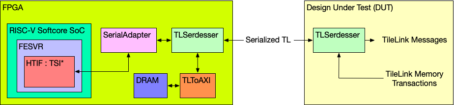

# Serial TileLink Bootflow

## Overview

This lab will have two parts, firstly conceptual to get familiar with TileLink and SerialTL protocol. The other will be hands on compiling and understanding potential linking errors under the hood. 


## 1. TileLink and Serial TileLink

### 1.1 TileLink
TileLink is a bus protocol used by Chipyard's memory subsystem. Please read and understand how Channel A and D works in Section 3 of the [TileLink Spec](https://starfivetech.com/uploads/tilelink_spec_1.8.1.pdf), this information will be useful in following sections. 


### 1.2 Serial TileLink

 Serial TileLink (SerialTL) protocol is an implementation of HTIF that is used to send commands to the RISC-V DUT. These SerialTL commands are simple R/W commands that are able to access the DUT’s memory space. During test, the host machine sends SerialTL commands through an USB adapter to DUT. The DUT then converts the SerialTL command into a TileLink request. This conversion is done by the SerialAdapter module (located in the `generators/testchipip` project). After the transaction is converted to TileLink, the TLSerdesser (located in `generators/testchipip`) serializes the transaction and sends it to the chip (this TLSerdesser is sometimes also referred to as a digital serial-link or SerDes). Once the serialized transaction is received on the chip, it is deserialized and masters a TileLink bus on the chip which handles the request. 
 
 TLDR: it very simply serializes TileLink packets into at least 7 wires, with configurable width of data wires and utilizes a [ready-valid interface](https://inst.eecs.berkeley.edu/~cs150/Documents/Interfaces.pdf) to transfer data in both directions. 

 7 wires (directions are from the perspective of testchip):
 - Clock signal
     - `TL_CLK` (from testchip)
 - testchip to FPGA link
     - `TL_OUT_VALID` (from testchip)
     - `TL_OUT_READY` (from FPGA)
     - `TL_OUT_BITS` (from testchip)
 - FPGA to testchip link
     - `TL_IN_VALID` (from FPGA)
     - `TL_IN_READY` (from testchip)
     - `TL_IN_BITS` (from FPGA)



As you can see, this is a very simple protocol with little hardware overhead. But there are downsides, because TileLink is infinitely patient and has no timeout. So if a packet is lost, corrupted, unrecoverable, or not replied, the whole chip will freeze. Watch out for chip-wide freezes when debugging, it is likely a TileLink issue when communicating over SerialTL. 


## 2. Loading Program over SerialTL

As we're still figuring out how to have 20+ people accessing only two OsciBear on one lab bench with one power supply & clock generator, we'll simply explain how our setup works for now & plan to expand this access down the road. The following labs are experimental procedures of remotely debugging OsciBear. 


### 2.1 SerialTL Packets on Osci
Please complete the following table using SerialTL code snippet from [OsciBear's verilog top](https://github.com/ucberkeley-ee290c/fa22/blob/main/oscibear/sp21/chipyard.TestHarness.EE290CBLEConfig.top.v), and save it for your future reference. Signal are ordered exactly how SerialTL serializes/deserializes, do not try to change the ordering. 


```verilog
module GenericSerializer(clock, reset, io_in_ready, io_in_valid,
     io_in_bits_chanId, io_in_bits_opcode, io_in_bits_param,
     io_in_bits_size, io_in_bits_source, io_in_bits_address,
     io_in_bits_data, io_in_bits_corrupt, io_in_bits_union,
     io_in_bits_last, io_out_ready, io_out_valid, io_out_bits);
  input clock, reset, io_in_valid, io_in_bits_corrupt, io_in_bits_last,
       io_out_ready;
  input [2:0] io_in_bits_chanId, io_in_bits_opcode, io_in_bits_param;
  input [3:0] io_in_bits_size, io_in_bits_source;
  input [31:0] io_in_bits_address;
  input [63:0] io_in_bits_data;
  input [7:0] io_in_bits_union;
  output io_in_ready, io_out_valid, io_out_bits;
```

| Signal      | Type (direction) | Width | 
| ----------- | ---------------- | ----- |
| (chanid)    | SerialTL         |  _    |
| a/d_opcode  | C                |  _    |
| a/d_param   | C                |  _    |
| a/d_size    | C                | z = _ |
| a/d_source  | C                | o = _ |
| a/d_address | C                | a = _ |
| a/d_data    | D                | 8w = _|
| d_corrupt   | D                |  _    |
| a/d_mask    | C                | w = _ |
| (last)      | SerialTL         |  1    |

Check that your total serdes data packet width is 123. The following ready valid wires is already part of SerialTL. 
| Signal      | Type (direction) | Width | 
| ----------- | ---------------- | ----- |
| a/d_valid   | V                |  1    | 
| a/d_ready   | R (inverted)     |  1    | 

The following table is a summary of packets transfered in channel A & D over TL-UL (uncached lightweight) as specified in 1.8.0.  

 | Message          | Operation | OpCode| Response      |
 |------------------|-----------|-------|---------------|
 | Get           (A)| Get       | 4     | AccessAckData |
 | AccessAckData (D)| Get/Atomic| 1     | N/A           |
 | PutFullData   (A)| Put       | 0     | AccessAck (must have contiguous mask)|
 | PutPartialData(A)| Put       | 1     | AccessAck (may have partial mask)|
 | AccessAck     (D)| Put       | 0     | N/A           |

### 2.2 Testing if SerialTL is Responding Correctly

To test if SerialTL is working, read out the BootROM and confirm the contents are correct. To further confirm, we constructed a SerialTL packet to write some code into the DTIM (scratchpad) and read it back. Let's try this process by hand, but there are two caviats we found out:

1. To send/recieve a SerialTL packet, we construct/deconstruct the message according to TileLink and *flip the bit order (reverse every bit)*. 

2. OsciBear is 32 bits, but the data width is 64, which means *the upper 32 bits of data are always 0* on this chip, and we need to change the `mask` field accordingly.


#### 2.2.1 Sending a SerialTL Read Request Packet (A Channel)
Construct an A Channel SerialTL packet yourself by trying to read the BootROM at `0x0001_0000`. Remember both caviats above and assume `last` will always be high. You can express this in verilog or in other language that you feel comfortable in, and given a handy imaginary `$reverse(in)` block to reverse the bit order. 

```
$reverse({ __ , ... , __})
```

#### 2.2.2 Recieving a SerialTL Read Reply Packet (D Channel)
What would you expect to read back if BootROM is the following? Just give us the `d_data` and the `d_mask`, remember caviat #2. 
```assembly
00010000 <_start>:
   10000:	020005b7          	lui	a1,0x2000
   10004:	f1402573          	csrr	a0,mhartid
   ...
```
```
d_data = $reverse(______)
d_mask = $reverse(______)
```
Now that we know our code is on the DTIM, time to let Osci free! 


### 2.2 Running code at DTIM

The full BootROM dump for Osci is [here](https://github.com/ucberkeley-ee290c/chipyard-osci-sky130/blob/master/generators/chipyard/src/main/scala/ee290c/bootrom/bootrom.rv32.dump), beware that the future chips are slightly different. A BootROM is a small read only memory consisting of boot code that jumps to various PC addresses. Basically, the core with hartid=0 will be in a loop checking for CLINT interrupts at `0x0200_0000`, the msip register. After finishing transfer of our code, we set the msip register to 1 through SerialTL, the BootROM will jump to `<boot_core_hart0>` and begin executing at `0x8000_0000`, our DTIM or scratchpad address. The jump is done by setting mepc and calling mret, for more about interrupts see [RISC-V Interrupts by Krste Asanovic](https://riscv.org/wp-content/uploads/2016/07/Tue0900_RISCV-20160712-Interrupts.pdf).


## 3. Compiling & Linking

### 3.1 Remember assembly code is different

Because the C assumes the system starts in a certain status, and during the early testing stage we cannot ensure those conditions, so we have to write assembly code to do basic testings. We need to pay attention to the differences, though, when converting the C code to assembly counterpart.

Here's a snippet of the code we first wrote in assembly to test basic UART functionality. We are trying to convert the following C code to assembly, and here's the result.

```C
#include <stdint.h>

uint32_t *UART_TXDATA = 0x1000U;

void UART_transmit(uint8_t char) {
  *UART_TXDATA = char;
}

int main() {
  while (1) {
    UART_transmit('H');
  }
}
```

```assmebly

# UART MMIO addr
li s0, 0x1000

UART_transmit:
    sw a0, 0(s0)    # store character into UART transmit buffer
    ret             # return

main:
  li a0, 'H'          # pass character 'H' as function argument
  call UART_transmit  # invoke the function
  j main

```

Inspect the code and use [venus](https://venus.cs61c.org) to understand why our code didn't work. Now, take a careful look at the memory map of OsciBear in the spec. At which address did we load the code from last section? Now what happens when we call `ret` in UART_transmit, what is in `x1` and where will we jump to? Explain why this code will only output "H" over UART once and never actually continue to print more. 

### 3.2 Compiling Code Properly
There are also a host of other issues, such as heap & stack pointer setups, where data section is located etc. All of these must be configured properly in the linker script .ld that is fed into the compiler, we will explore how to configure the loading location of code in the this section. 

This toolchain is only tested on linux, if it doesn't work on your local OS, please create an cs199 account and log into hive to complete this section. Follow instructions [here](https://inst.eecs.berkeley.edu/share/b/pub/disk.quotas) to get extra disk quota, and create a symbol link as follows so `tmp` shows up in your local folders. 
```
$ ln -s /home/tmp/$USER tmp
$ ls
tmp
```

Download the binaries from https://github.com/sifive/freedom-tools/releases. Add the bin folder to your env path. 

For cs199 accounts, run the following commands to setup compiler enviornment.
```
$ cd tmp
$ wget https://static.dev.sifive.com/dev-tools/freedom-tools/v2020.12/riscv64-unknown-elf-toolchain-10.2.0-2020.12.8-x86_64-linux-ubuntu14.tar.gz


~/tmp $ ls
fa22  riscv64-unknown-elf-toolchain-10.2.0-2020.12.8-x86_64-linux-ubuntu14.tar.gz
tar -xvzf riscv64-unknown-elf-toolchain-10.2.0-2020.12.8-x86_64-linux-ubuntu14.tar.gz
$ export PATH="$PATH:/home/aa/users/cs199-___/tmp/riscv64-unknown-elf-toolchain-10.2.0-2020.12.8-x86_64-linux-ubuntu14/bin"
```

You can automate the last line into `./profile` or an `env.sh` for future use.

#### 3.2.1 Declaring Scratchpad
We've taken the liberty for you to easily insert where everything (code binary, heap, stack, etc.) should be located, fill in the following two blanks in `./core/oscibear.ld` with the proper number to get the compiler working with correct linking parameters. The argument `ORIGIN` sets where and `LENGTH` sets how large the `SRAM` is. For more details, see [GNU Linker Manual: Memory Layout](https://ftp.gnu.org/old-gnu/Manuals/ld-2.9.1/html_chapter/ld_3.html#SEC16).
```
/* Normally ENTRY(_start) to setup the pointer enviornments for C
 * For now uses main in C to simpify.
 */
ENTRY(main)

MEMORY {
  SRAM(rwx): ORIGIN = 0x_0000000, LENGTH = _K
}
...
```

#### 3.2.2 Relocation
You may see different segments corresponding to the `.text` (code), `.data` (initialized data), `.bss` (uninitialized data). There are also prefixes such as `.sdata`, where `s` means short/small (for small non array data); and `.tdata`, where `t` means thread local. In those segments mentioned above, we declared `> SRAM` to restrict these segments to be inside the OsciBear's onboard SRAM scratchpad, as shown below. For more details, see [GNU Linker Manual: Optional Section Attributes](https://ftp.gnu.org/old-gnu/Manuals/ld-2.9.1/html_chapter/ld_3.html#SEC21)
```
  .sdata : {
    __global_pointer$ = . + 0x800;
    *(.srodata.cst16) *(.srodata.cst8) *(.srodata.cst4) *(.srodata.cst2) *(.srodata*)
    *(.rodata)
    *(.sdata .sdata.* .gnu.linkonce.s.*)
    . = ALIGN(4);
  }> SRAM
```
If you're confused about `__global_pointer`, don't worry about it. This is an optimization topic called linker relaxation, you can optionally read about it at [Linker Relaxation, SiFive's Blog](https://www.sifive.com/blog/all-aboard-part-3-linker-relaxation-in-riscv-toolchain).

#### 3.2.3 Running the Compiler
Our makefile will compile your `hello.c` code with the proper linker script while saving the `.riscv.dump`, `.riscv.debug`, and the actual binary elf. 
```
make all
```


**Please attach the entire objdump file (`hello.riscv.dump`), check that your code is indeed starts at 0x8000_0000.** 


### 3.3 Compiler and Linker Flags
Most compiler binaries are prebuilt for certain sets of architectures, and sometimes we can't find an exact match. For example, float must be enabled on sifive's compiler binary to access csr registers, but sometimes we don't have fdiv on our chip. This can be avoided by disabling float using a flag in compiler `-mno-fdiv`. We also put `-nostartfiles` flags in the linker because we don't have a `_start`. `-nostdlib` can also be put into the linker to disable linking standard libraries. 


### 4. Acknowledgements & References

Code: -T.K.- (tk233 at berkeley dot edu)

Writeup: Franklin Huang (hongyihuang at berkeley dot edu)

Makefile & Supervising TA: Nayiri (nayiri at berkeley dot edu)

[Communicating with the DUT, Chipyard documentation version "main"](https://chipyard.readthedocs.io/en/latest/Advanced-Concepts/Chip-Communication.html)

[ready-valid interface cs150 by Chris Fletcher](https://inst.eecs.berkeley.edu/~cs150/Documents/Interfaces.pdf)

[RISC-V Interrupts by Krste Asanovic](https://riscv.org/wp-content/uploads/2016/07/Tue0900_RISCV-20160712-Interrupts.pdf)

[GNU Linker Manual](https://ftp.gnu.org/old-gnu/Manuals/ld-2.9.1/html_chapter/ld_toc.html#TOC5)

[Relocation, SiFive's Blog](https://www.sifive.com/blog/all-aboard-part-2-relocations)

[Linker Relaxation, SiFive's Blog](https://www.sifive.com/blog/all-aboard-part-3-linker-relaxation-in-riscv-toolchain)
