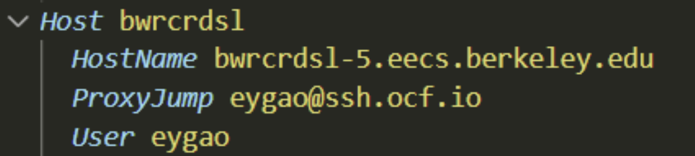

# Setting up Software and Accounts for Bringup

## Getting Help with Tools and BWRC Resources

Inevitably, at some point, some tool will not work the way as you expect.  First, search through existing resources (e.g. the Google sites).  Then, try to ask your peers for help, and record any knowledge you find to share with future students.

The ultimate resource is asking BWRC sys-admins by emailing [bwrc-sysadmins@lists.eecs.berkeley.edu](bwrc-sysadmins@lists.eecs.berkeley.edu).  When emailing them, make sure to include as much useful information as you can (e.g. not just “this broke, help.”).  For instance, include:

- Screenshots of the error
- Which machine (login and LSF) you are using
- Which tool and version you are using
- Links to your .bashrc or other source files.


## Access Checklist

Below is a checklist for access to accounts and resources. Please make sure you have completed this checklist 

- [X] Completed BWRC Forms DocuSign in an email titled "\*\*Action Required\*\* Complete BWRC Forms"
- [X] Received IRIS account login in an email titled "IRIS Account request for FirstName LastName" and verified it via IRIS Self-Serve website
- [X] If accessing previous semester tapeout material or simulating chip standard cells, sign Intel NDA (**Note:** If you have previously signed the Intel NDA, you do not have to re-sign it).

## Setting up Berkeley VPN

To access the BWRC GitLab repository and establish a remote connection to the BWRC remote machines, you need to be connect to the berkeley VPN. The only exception is when you are physically connected to the network via a wired Ethernet connection in BWRC. 

[bSecure VPN Homepage](https://security.berkeley.edu/services/bsecure/bsecure-remote-access-vpn%20)

First download GlobalProtect Software for your machine (32/64-bit Mac and 32/64-bit Windows---for other OS'es see bSecure Homepage above) from [vpn.berkeley.edu](https://vpn.berkeley.edu/global-protect/getsoftwarepage.esp)

**Note:** If you have an ARM64 machine use [this GlobalProtect installer](https://nuwildcat.sharepoint.com/:u:/r/teams/gl_nuit_tss-EndpointDeviceManagement/Shared%20Documents/EDM%20Enterprise%20Services/Software%20Repository/GlobalProtect/Windows/ARM%2064/GlobalProtectARM64-6.2.8-c263.msi?csf=1&web=1&e=Vsbt0n) instead

Once you open GlobalProtect and click connect, your browser will open with the Calnet login. Enter your credentials and sign in.

Then two tabs of Palo Alto Networks will open up asking you to open GlobalProtect. **You must press open on both tabs**

Connect with the GP client
Choose Gateway: Full Tunnel or Split Tunnel
- Full Tunnel: All traffic is tunneled. Choose this one for bringup.
- Split Tunnel: Only berkeley.edu traffic is tunneled.


## Testing IRIS account

To access both the BWRC GitLab repository and establish a remote connection to the BWRC remote machines, you need an active IRIS account. To test your IRIS account use [this tool](https://iris2.eecs.berkeley.edu/selfserve/testldap/) from the IRIS self-serve website

If you have forgotten/wish to change your password, you can recover/change it [here](https://iris2.eecs.berkeley.edu/selfserve/adpasswd/) (Click on 'Email' if you have forgotten your password and wish to receive a recovery link via email)

## SSH Access to BWRC Machines on Your Local Machine

There are 6 BWRC remote machines that you can access, bwrcrdsl-X.eecs.berkeley.edu where X can be 1-6.

**Note:** For SSH and VSCode access, we recommend machines 5 and 6 if they are not too busy.

### Terminal (Git Bash)

Once you are connected through the VPN and connected to eduroam, you can connect in a terminal via SSH from anywhere on or off campus.


Most login services require the VPN to access while off campus. This can get annoying having to constantly reauthenticate. Instead, you can proxyjump through a secured server on campus that allows external access like OCF or Millennium instead



### VSCode
[VS Code](https://code.visualstudio.com/) is the recommended tool for this lab to SSH into the BWRC machines remotely. In VS Code, click Ctrl+Shift+P to bring up the task panel. Then, enter "Connect to Host" and select the corresponding task.

**Note:** You may need to install the Remote -- SSH extension on VS Code first


Enter 'your_username@bwrcrdsl-X.eecs.berkeley.edu'


In the pop-up panel, select 'Linux', then select 'Continue', and then enter your password. Now you should be connected to the compute cluster.


## Chipyard+Baremetal IDE access and RISC-V Toolchain

RISC-V 64 bit toolchains is by default available on BWRC machines. Chipyard and BaremetalIDE repositories will be cloned onto your account on the BWRC machines. You should not have to clone these repositories or build the RISC-V Toolchain locally on your machine.

## Creating Your Directory on BWRC Machine

Each of you will have your own directory under the BWRC machines. **First check if one already exists under you username** (the path will be 'tools/C/<your username>').

If not, please create one under '/tools/C/' 

Run 
```
 <your username>@bwrcrdsl-#:/tools/C/ $ mkdir <your username>
```

## Setting Up Your Conda Environment 

[Anaconda](https://www.anaconda.com/) (conda) is a popular Python package manager.  At BWRC, for the most part, individuals install conda themselves for personal use.  They can share environments using an environment.yml file and further customize the environments themselves.  Pip packages can also be controlled in conda environments.

Check your directory '/tools/C/<your username>' for either miniforge3 or miniconda3.

If you have one of these already you are good to go.

Otherwise, we recommend installing [miniconda](https://www.anaconda.com/docs/getting-started/miniconda/install) or [miniforge](https://github.com/conda-forge/miniforge) (You can download miniforge from [here](https://conda-forge.org/download/#:~:text=Basic%20installation%20instructions%20are%20available%20below.%20More%20detailed,Miniforge3-%24%28uname%29-%24%28uname%20-m%29.sh%20Download%20and%20execute%20the%20Windows%20installer.) but we will show you how to download via wget in a few moments) in a tools space (e.g your /tools/C) and pointing to, or activating, it as necessary.

### Below are a Walkthrough of Installing Miniforge

To download the latest miniforge version
Run
```
 <your username>@bwrcrdsl-#:/tools/C/<your username> $ wget "https://github.com/conda-forge/miniforge/releases/latest/download/Miniforge3-$(uname)-$(uname -m).sh"
```
To install, 
Run 
```
 <your username>@bwrcrdsl-#:/tools/C/<your username> $ bash Miniforge3-$(uname)-$(uname -m).sh -b 
```
Then
Run 
```
 <your username>@bwrcrdsl-#:/tools/C/<your username> $ source ~/.bashrc
 <your username>@bwrcrdsl-#:/tools/C/<your username> $ source ~/miniforge3/bin/activate
 <your username>@bwrcrdsl-#:/tools/C/<your username> $ conda config --set channel_priority true
 <your username>@bwrcrdsl-#:/tools/C/<your username> $ conda install -n base conda-libmamba-solver
 <your username>@bwrcrdsl-#:/tools/C/<your username> $ conda config --set solver libmamba
 <your username>@bwrcrdsl-#:/tools/C/<your username> $ conda install -n base conda-lock==1.4.0
 <your username>@bwrcrdsl-#:/tools/C/<your username> $ conda activate base

```

Resources:

- [Managing Conda Environments](https://conda.io/projects/conda/en/latest/user-guide/tasks/manage-environments.html)

- [Conda Cheatsheet](https://docs.conda.io/projects/conda/en/latest/_downloads/843d9e0198f2a193a3484886fa28163c/conda-cheatsheet.pdf)


Conda libraries sometimes come in conflict with libraries needed by the virtual desktop, causing issues with loading remote desktop sessions.  As such, **we recommend against having conda activate by default** (i.e. conda base should be available after running `conda activate base`).


During the installation process, this can be toggled off.


If you do run into an issue with loading the remote desktop, SSH into an RDSL machine, and follow one of these options (step 1 should be sufficient).


## Altium Setup

### Creating Your Altium Account

First, create a Altium Student Lab account [here](https://www.altium.com/education/students#). Use your berkeley email address.
**Note:** It might take a day or two to get a response after you fill out the form on the website.

### Downloading Altium Designer

Once you have created your student lab account, [download Altium Designer](https://www.altium.com/products/downloads). Make sure you are signed into your student account (look at the top right of the page and you should see your google account icon).

Make sure PCB Design, Platform Extensions, and Importers/Exporters are all selected.

You can download Altium to the default Application Path.

Once the installation is complete, open Altium (Should take 1-2 minutes)

### Opening Altium 

When you first open Altium, you may be prompted to Import old settings, skip it. You will be prompted to sign in to your account. Click sign-in and a webpage will open up in your default browser where you can sign in to your Altium account.

Upon boot and after signing in, the License Management page will open up. Select an active license and click 'Use'.

**Note:** If there is no active license, double check that you are signed in to your account and that Altium’s online profile setting shows this.

Once you have create an account, we will add you the the 'UC Berkeley - EE194' 365 Workspace. You can connect to the 365 Workspace in the app by clicking the 365 Workspace tab in the top right corner (Cloud Icon) and selecting the EE194 workspace. 

Finally, we want to install the required extensions. Click your account profile (Person Icon) in the upper right hand corner and then 'Updates and Extensions' 

Under the 'Available' tab, install the following extensions:
- ActiveRoute
- Draftsman
- Ansys CoDesigner
- Power Analyzer by Keysight
- LTSpice Importer
- Signal Integrity Analysis
- Mixed Simulation

**Note:** This is the page you can also use to install Altium Updates under the 'Updates' tab.

For ease of creating new components I recommend adding the [SamacSys Library Loader Extension](https://www.samacsys.com/altium-designer-library-instructions/) to your Altium, but it is not required.


